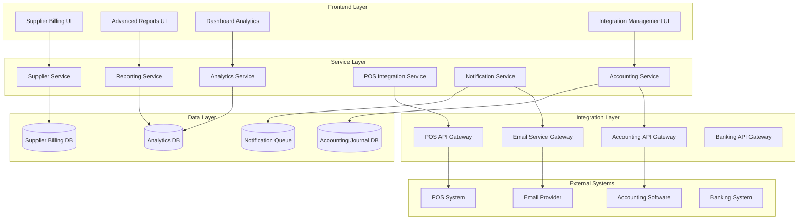

# Design Document - Supplier Billing Advanced Features

## Overview

This design document outlines the architecture and implementation approach for extending the existing Supplier Billing system with advanced features including accounting integration, advanced reporting, POS integration, and automated reminders. The design builds upon the current system architecture while adding new modules and services.

## Architecture

### High-Level Architecture



### System Components

#### 1. Accounting Integration Module
- **Journal Entry Service**: Automatically creates accounting entries
- **Account Mapping Service**: Maps supplier transactions to chart of accounts
- **Reconciliation Service**: Provides reconciliation between systems
- **Audit Trail Service**: Maintains compliance audit trails

#### 2. Advanced Reporting Module
- **Report Engine**: Generates various types of reports
- **Analytics Engine**: Processes data for insights and trends
- **Export Service**: Handles multiple export formats
- **Scheduler Service**: Manages automated report generation

#### 3. POS Integration Module
- **Inventory Sync Service**: Synchronizes inventory levels
- **Purchase Order Automation**: Creates POs based on stock levels
- **Supplier Matching Service**: Matches products to preferred suppliers
- **Real-time Sync Service**: Maintains data consistency

#### 4. Automated Reminders Module
- **Notification Engine**: Manages all types of notifications
- **Template Service**: Handles customizable message templates
- **Scheduling Service**: Manages reminder schedules
- **Communication Logger**: Tracks all communications

## Components and Interfaces

### 1. Accounting Integration Components

#### AccountingService Interface
```typescript
interface AccountingService {
  createJournalEntry(transaction: SupplierTransaction): Promise<JournalEntry>;
  getChartOfAccounts(): Promise<Account[]>;
  reconcileSupplierBalances(period: DateRange): Promise<ReconciliationReport>;
  syncWithExternalSystem(systemType: AccountingSystemType): Promise<SyncResult>;
}
```

#### JournalEntry Data Model
```typescript
interface JournalEntry {
  id: string;
  entryNumber: string;
  transactionDate: Date;
  description: string;
  reference: string;
  totalDebit: number;
  totalCredit: number;
  entries: JournalEntryLine[];
  status: 'draft' | 'posted' | 'reversed';
  createdBy: string;
  createdAt: Date;
}

interface JournalEntryLine {
  accountCode: string;
  accountName: string;
  debitAmount: number;
  creditAmount: number;
  description: string;
  reference: string;
}
```

### 2. Advanced Reporting Components

#### ReportingService Interface
```typescript
interface ReportingService {
  generateSupplierPerformanceReport(params: ReportParams): Promise<Report>;
  generateSpendingAnalysisReport(params: ReportParams): Promise<Report>;
  generateAgingReport(params: ReportParams): Promise<Report>;
  generateCashFlowProjection(params: ReportParams): Promise<Report>;
  scheduleReport(schedule: ReportSchedule): Promise<ScheduledReport>;
  exportReport(reportId: string, format: ExportFormat): Promise<ExportResult>;
}
```

#### Report Data Models
```typescript
interface Report {
  id: string;
  name: string;
  type: ReportType;
  parameters: ReportParams;
  data: any[];
  metadata: ReportMetadata;
  generatedAt: Date;
  generatedBy: string;
}

interface SupplierPerformanceMetrics {
  supplierId: string;
  supplierName: string;
  totalSpend: number;
  averagePaymentDays: number;
  onTimeDeliveryRate: number;
  qualityScore: number;
  reliabilityScore: number;
  costEfficiencyRating: number;
}
```

### 3. POS Integration Components

#### POSIntegrationService Interface
```typescript
interface POSIntegrationService {
  syncInventoryLevels(): Promise<SyncResult>;
  processLowStockAlerts(alerts: StockAlert[]): Promise<PurchaseOrder[]>;
  updateInventoryFromDelivery(delivery: Delivery): Promise<UpdateResult>;
  getPreferredSuppliers(productId: string): Promise<Supplier[]>;
  createAutomaticPurchaseOrder(stockAlert: StockAlert): Promise<PurchaseOrder>;
}
```

#### Stock Management Data Models
```typescript
interface StockAlert {
  productId: string;
  productName: string;
  currentStock: number;
  reorderPoint: number;
  reorderQuantity: number;
  preferredSupplierId: string;
  urgencyLevel: 'low' | 'medium' | 'high' | 'critical';
  generatedAt: Date;
}

interface AutoPurchaseOrder {
  id: string;
  orderNumber: string;
  supplierId: string;
  items: PurchaseOrderItem[];
  totalAmount: number;
  expectedDeliveryDate: Date;
  status: 'draft' | 'sent' | 'confirmed' | 'delivered';
  automationReason: string;
  createdAt: Date;
}
```

### 4. Automated Reminders Components

#### NotificationService Interface
```typescript
interface NotificationService {
  schedulePaymentReminder(invoice: SupplierInvoice): Promise<ScheduledNotification>;
  sendOverdueNotification(invoice: SupplierInvoice): Promise<NotificationResult>;
  sendMonthlyStatement(supplier: Supplier): Promise<NotificationResult>;
  createCustomReminder(reminder: CustomReminder): Promise<ScheduledNotification>;
  getNotificationHistory(filters: NotificationFilters): Promise<NotificationHistory[]>;
}
```

#### Notification Data Models
```typescript
interface ScheduledNotification {
  id: string;
  type: NotificationType;
  recipientEmail: string;
  subject: string;
  content: string;
  scheduledFor: Date;
  status: 'scheduled' | 'sent' | 'failed' | 'cancelled';
  templateId: string;
  relatedEntityId: string;
  relatedEntityType: string;
}

interface NotificationTemplate {
  id: string;
  name: string;
  type: NotificationType;
  subject: string;
  htmlContent: string;
  textContent: string;
  variables: TemplateVariable[];
  isActive: boolean;
}
```

## Data Models

### Extended Database Schema

#### 1. Accounting Integration Tables
```sql
-- Journal Entries
CREATE TABLE journal_entries (
    id UUID PRIMARY KEY DEFAULT uuid_generate_v4(),
    entry_number VARCHAR(50) UNIQUE NOT NULL,
    transaction_date DATE NOT NULL,
    description TEXT,
    reference VARCHAR(100),
    total_debit DECIMAL(12,2) NOT NULL,
    total_credit DECIMAL(12,2) NOT NULL,
    status VARCHAR(20) DEFAULT 'draft',
    source_type VARCHAR(50), -- 'supplier_invoice', 'supplier_payment'
    source_id UUID,
    created_by UUID,
    created_at TIMESTAMP WITH TIME ZONE DEFAULT NOW(),
    posted_at TIMESTAMP WITH TIME ZONE
);

-- Journal Entry Lines
CREATE TABLE journal_entry_lines (
    id UUID PRIMARY KEY DEFAULT uuid_generate_v4(),
    journal_entry_id UUID REFERENCES journal_entries(id),
    account_code VARCHAR(20) NOT NULL,
    account_name VARCHAR(255) NOT NULL,
    debit_amount DECIMAL(12,2) DEFAULT 0,
    credit_amount DECIMAL(12,2) DEFAULT 0,
    description TEXT,
    reference VARCHAR(100)
);

-- Chart of Accounts
CREATE TABLE chart_of_accounts (
    id UUID PRIMARY KEY DEFAULT uuid_generate_v4(),
    account_code VARCHAR(20) UNIQUE NOT NULL,
    account_name VARCHAR(255) NOT NULL,
    account_type VARCHAR(50) NOT NULL,
    parent_account_id UUID REFERENCES chart_of_accounts(id),
    is_active BOOLEAN DEFAULT true,
    created_at TIMESTAMP WITH TIME ZONE DEFAULT NOW()
);
```

#### 2. Reporting and Analytics Tables
```sql
-- Report Definitions
CREATE TABLE report_definitions (
    id UUID PRIMARY KEY DEFAULT uuid_generate_v4(),
    name VARCHAR(255) NOT NULL,
    type VARCHAR(50) NOT NULL,
    description TEXT,
    sql_query TEXT,
    parameters JSONB,
    is_active BOOLEAN DEFAULT true,
    created_by UUID,
    created_at TIMESTAMP WITH TIME ZONE DEFAULT NOW()
);

-- Scheduled Reports
CREATE TABLE scheduled_reports (
    id UUID PRIMARY KEY DEFAULT uuid_generate_v4(),
    report_definition_id UUID REFERENCES report_definitions(id),
    name VARCHAR(255) NOT NULL,
    schedule_cron VARCHAR(100) NOT NULL,
    recipients TEXT[],
    parameters JSONB,
    last_run_at TIMESTAMP WITH TIME ZONE,
    next_run_at TIMESTAMP WITH TIME ZONE,
    is_active BOOLEAN DEFAULT true
);

-- Supplier Performance Metrics
CREATE TABLE supplier_performance_metrics (
    id UUID PRIMARY KEY DEFAULT uuid_generate_v4(),
    supplier_id UUID REFERENCES suppliers(id),
    period_start DATE NOT NULL,
    period_end DATE NOT NULL,
    total_spend DECIMAL(12,2) DEFAULT 0,
    invoice_count INTEGER DEFAULT 0,
    average_payment_days DECIMAL(5,2) DEFAULT 0,
    on_time_delivery_rate DECIMAL(5,2) DEFAULT 0,
    quality_score DECIMAL(3,2) DEFAULT 0,
    reliability_score DECIMAL(3,2) DEFAULT 0,
    calculated_at TIMESTAMP WITH TIME ZONE DEFAULT NOW()
);
```

#### 3. POS Integration Tables
```sql
-- Stock Alerts
CREATE TABLE stock_alerts (
    id UUID PRIMARY KEY DEFAULT uuid_generate_v4(),
    product_id UUID NOT NULL,
    product_name VARCHAR(255) NOT NULL,
    current_stock INTEGER NOT NULL,
    reorder_point INTEGER NOT NULL,
    reorder_quantity INTEGER NOT NULL,
    preferred_supplier_id UUID REFERENCES suppliers(id),
    urgency_level VARCHAR(20) DEFAULT 'medium',
    status VARCHAR(20) DEFAULT 'pending',
    processed_at TIMESTAMP WITH TIME ZONE,
    created_at TIMESTAMP WITH TIME ZONE DEFAULT NOW()
);

-- Auto Purchase Orders
CREATE TABLE auto_purchase_orders (
    id UUID PRIMARY KEY DEFAULT uuid_generate_v4(),
    order_number VARCHAR(50) UNIQUE NOT NULL,
    supplier_id UUID REFERENCES suppliers(id),
    total_amount DECIMAL(12,2) NOT NULL,
    expected_delivery_date DATE,
    status VARCHAR(20) DEFAULT 'draft',
    automation_reason TEXT,
    stock_alert_id UUID REFERENCES stock_alerts(id),
    created_at TIMESTAMP WITH TIME ZONE DEFAULT NOW()
);

-- Integration Sync Log
CREATE TABLE integration_sync_log (
    id UUID PRIMARY KEY DEFAULT uuid_generate_v4(),
    integration_type VARCHAR(50) NOT NULL,
    sync_type VARCHAR(50) NOT NULL,
    status VARCHAR(20) NOT NULL,
    records_processed INTEGER DEFAULT 0,
    errors_count INTEGER DEFAULT 0,
    error_details JSONB,
    started_at TIMESTAMP WITH TIME ZONE DEFAULT NOW(),
    completed_at TIMESTAMP WITH TIME ZONE
);
```

#### 4. Notification System Tables
```sql
-- Notification Templates
CREATE TABLE notification_templates (
    id UUID PRIMARY KEY DEFAULT uuid_generate_v4(),
    name VARCHAR(255) NOT NULL,
    type VARCHAR(50) NOT NULL,
    subject VARCHAR(500) NOT NULL,
    html_content TEXT,
    text_content TEXT,
    variables JSONB,
    is_active BOOLEAN DEFAULT true,
    created_at TIMESTAMP WITH TIME ZONE DEFAULT NOW()
);

-- Scheduled Notifications
CREATE TABLE scheduled_notifications (
    id UUID PRIMARY KEY DEFAULT uuid_generate_v4(),
    type VARCHAR(50) NOT NULL,
    recipient_email VARCHAR(255) NOT NULL,
    subject VARCHAR(500) NOT NULL,
    content TEXT,
    scheduled_for TIMESTAMP WITH TIME ZONE NOT NULL,
    status VARCHAR(20) DEFAULT 'scheduled',
    template_id UUID REFERENCES notification_templates(id),
    related_entity_id UUID,
    related_entity_type VARCHAR(50),
    sent_at TIMESTAMP WITH TIME ZONE,
    error_message TEXT,
    created_at TIMESTAMP WITH TIME ZONE DEFAULT NOW()
);

-- Notification History
CREATE TABLE notification_history (
    id UUID PRIMARY KEY DEFAULT uuid_generate_v4(),
    notification_id UUID REFERENCES scheduled_notifications(id),
    status VARCHAR(20) NOT NULL,
    response_data JSONB,
    error_message TEXT,
    created_at TIMESTAMP WITH TIME ZONE DEFAULT NOW()
);
```

## Error Handling

### Error Handling Strategy

1. **Service Level Errors**
   - Implement try-catch blocks in all service methods
   - Use custom error classes for different error types
   - Log errors with appropriate severity levels
   - Return standardized error responses

2. **Integration Errors**
   - Implement retry mechanisms with exponential backoff
   - Queue failed operations for manual review
   - Provide fallback mechanisms where possible
   - Alert administrators of critical integration failures

3. **Data Validation Errors**
   - Validate data at service boundaries
   - Provide clear error messages for validation failures
   - Implement client-side validation for better UX
   - Log validation errors for monitoring

4. **External System Errors**
   - Handle timeout and connection errors gracefully
   - Implement circuit breaker patterns for external APIs
   - Provide offline capabilities where feasible
   - Cache responses to reduce external dependencies

### Error Types and Handling

```typescript
// Custom Error Classes
class AccountingIntegrationError extends Error {
  constructor(message: string, public code: string, public details?: any) {
    super(message);
    this.name = 'AccountingIntegrationError';
  }
}

class POSIntegrationError extends Error {
  constructor(message: string, public code: string, public details?: any) {
    super(message);
    this.name = 'POSIntegrationError';
  }
}

class NotificationError extends Error {
  constructor(message: string, public code: string, public details?: any) {
    super(message);
    this.name = 'NotificationError';
  }
}

// Error Handler Service
interface ErrorHandlerService {
  handleServiceError(error: Error, context: string): Promise<void>;
  handleIntegrationError(error: Error, integration: string): Promise<void>;
  logError(error: Error, severity: 'low' | 'medium' | 'high' | 'critical'): Promise<void>;
  notifyAdministrators(error: Error, context: string): Promise<void>;
}
```

## Testing Strategy

### Testing Approach

1. **Unit Testing**
   - Test all service methods with mock dependencies
   - Test data transformation and validation logic
   - Test error handling scenarios
   - Achieve minimum 80% code coverage

2. **Integration Testing**
   - Test database operations with test database
   - Test external API integrations with mock services
   - Test end-to-end workflows
   - Test error scenarios and recovery

3. **Performance Testing**
   - Load test report generation with large datasets
   - Test concurrent user scenarios
   - Test integration performance under load
   - Monitor memory usage and optimize

4. **Security Testing**
   - Test authentication and authorization
   - Test data encryption and secure transmission
   - Test SQL injection and XSS vulnerabilities
   - Perform penetration testing

### Test Data Management

```typescript
// Test Data Factory
interface TestDataFactory {
  createTestSupplier(overrides?: Partial<Supplier>): Supplier;
  createTestInvoice(supplierId: string, overrides?: Partial<SupplierInvoice>): SupplierInvoice;
  createTestPayment(invoiceId: string, overrides?: Partial<SupplierPayment>): SupplierPayment;
  createTestJournalEntry(transactionId: string): JournalEntry;
  cleanupTestData(): Promise<void>;
}

// Mock Services
interface MockAccountingService extends AccountingService {
  setMockResponse(method: string, response: any): void;
  simulateError(method: string, error: Error): void;
  getCallHistory(): MethodCall[];
}
```

## Security Considerations

### Security Measures

1. **Authentication and Authorization**
   - Implement multi-factor authentication for sensitive operations
   - Use role-based access control (RBAC)
   - Implement API key management for integrations
   - Regular security audits and access reviews

2. **Data Protection**
   - Encrypt sensitive data at rest and in transit
   - Implement data masking for non-production environments
   - Regular security scans and vulnerability assessments
   - Secure backup and recovery procedures

3. **API Security**
   - Implement rate limiting and throttling
   - Use HTTPS for all communications
   - Validate and sanitize all inputs
   - Implement proper CORS policies

4. **Audit and Compliance**
   - Maintain comprehensive audit logs
   - Implement data retention policies
   - Regular compliance assessments
   - Incident response procedures

### Security Implementation

```typescript
// Security Service Interface
interface SecurityService {
  authenticateUser(credentials: UserCredentials): Promise<AuthResult>;
  authorizeAction(user: User, action: string, resource: string): Promise<boolean>;
  encryptSensitiveData(data: any): Promise<string>;
  decryptSensitiveData(encryptedData: string): Promise<any>;
  logSecurityEvent(event: SecurityEvent): Promise<void>;
  validateApiKey(apiKey: string): Promise<ApiKeyValidation>;
}

// Audit Service Interface
interface AuditService {
  logUserAction(user: User, action: string, details: any): Promise<void>;
  logSystemEvent(event: string, details: any): Promise<void>;
  logDataAccess(user: User, table: string, operation: string): Promise<void>;
  generateAuditReport(period: DateRange): Promise<AuditReport>;
}
```

This design provides a comprehensive foundation for implementing the advanced features while maintaining security, performance, and maintainability standards.