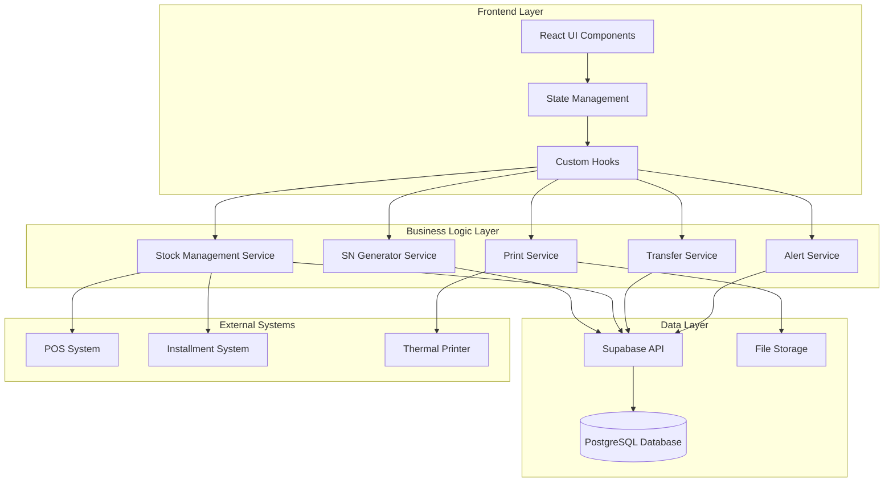
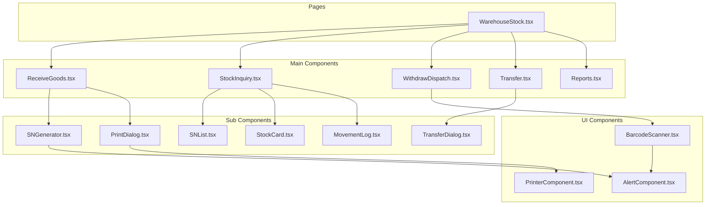

# Design Document

## Overview

ระบบคลังและสต็อกสินค้าที่ปรับปรุงใหม่ เป็นระบบที่ออกแบบมาเพื่อจัดการสินค้าแบบ Serial Number (SN) รายชิ้น โดยใช้สถาปัตยกรรมแบบ modular ที่เชื่อมโยงกับระบบ POS และเช่าซื้อที่มีอยู่ ระบบนี้จะขยายจากโครงสร้างฐานข้อมูลเดิมและเพิ่มฟีเจอร์การติดตาม SN แบบ real-time

## Architecture

### System Architecture



### Component Architecture



## Components and Interfaces

### Core Components

#### 1. ReceiveGoods Component
```typescript
interface ReceiveGoodsProps {
  onReceiveComplete: (receiveData: ReceiveData) => void;
}

interface ReceiveData {
  productId: string;
  quantity: number;
  unitCost: number;
  supplierId: string;
  invoiceNumber: string;
  generatedSNs: SerialNumber[];
}
```

#### 2. StockInquiry Component
```typescript
interface StockInquiryProps {
  searchFilters: SearchFilters;
  onFilterChange: (filters: SearchFilters) => void;
}

interface SearchFilters {
  searchTerm?: string;
  category?: string;
  brand?: string;
  model?: string;
  serialNumber?: string;
  warehouseId?: string;
  status?: StockStatus;
}
```

#### 3. WithdrawDispatch Component
```typescript
interface WithdrawDispatchProps {
  mode: 'withdraw' | 'dispatch' | 'claim';
  onTransactionComplete: (transaction: StockTransaction) => void;
}

interface StockTransaction {
  type: TransactionType;
  items: TransactionItem[];
  reference?: string;
  notes?: string;
}
```

#### 4. Transfer Component
```typescript
interface TransferProps {
  sourceWarehouse: Warehouse;
  onTransferInitiate: (transfer: TransferRequest) => void;
  onTransferConfirm: (transferId: string) => void;
}

interface TransferRequest {
  sourceWarehouseId: string;
  targetWarehouseId: string;
  items: TransferItem[];
  notes?: string;
}
```

### Service Interfaces

#### 1. SN Generator Service
```typescript
interface SNGeneratorService {
  generateSN(productId: string, quantity: number): Promise<SerialNumber[]>;
  validateSN(serialNumber: string): Promise<boolean>;
  getSNDetails(serialNumber: string): Promise<SerialNumberDetails>;
}

interface SerialNumber {
  id: string;
  serialNumber: string;
  productId: string;
  unitCost: number;
  status: SNStatus;
  warehouseId: string;
  createdAt: Date;
  updatedAt: Date;
}
```

#### 2. Stock Management Service
```typescript
interface StockManagementService {
  getStockLevels(filters: StockFilters): Promise<StockLevel[]>;
  updateStock(transaction: StockTransaction): Promise<void>;
  getMovementHistory(filters: MovementFilters): Promise<StockMovement[]>;
  checkStockAlerts(): Promise<StockAlert[]>;
}

interface StockLevel {
  productId: string;
  warehouseId: string;
  totalQuantity: number;
  availableQuantity: number;
  reservedQuantity: number;
  serialNumbers: SerialNumber[];
}
```

#### 3. Transfer Service
```typescript
interface TransferService {
  initiateTransfer(request: TransferRequest): Promise<Transfer>;
  confirmTransfer(transferId: string, confirmerId: string): Promise<void>;
  cancelTransfer(transferId: string, reason: string): Promise<void>;
  getTransferHistory(filters: TransferFilters): Promise<Transfer[]>;
}

interface Transfer {
  id: string;
  transferNumber: string;
  sourceWarehouseId: string;
  targetWarehouseId: string;
  status: TransferStatus;
  items: TransferItem[];
  initiatedBy: string;
  confirmedBy?: string;
  createdAt: Date;
  confirmedAt?: Date;
}
```

#### 4. Print Service
```typescript
interface PrintService {
  printReceiveDocument(receiveData: ReceiveData): Promise<void>;
  printSNStickers(serialNumbers: SerialNumber[]): Promise<void>;
  printTransferDocument(transfer: Transfer): Promise<void>;
  printStockReport(reportData: StockReportData): Promise<void>;
}
```

## Data Models

### Database Schema Extensions

#### 1. Serial Numbers Table
```sql
CREATE TABLE product_serial_numbers (
    id UUID PRIMARY KEY DEFAULT gen_random_uuid(),
    serial_number VARCHAR(50) UNIQUE NOT NULL,
    product_id UUID REFERENCES products(id) ON DELETE CASCADE,
    warehouse_id UUID REFERENCES warehouses(id),
    unit_cost DECIMAL(10,2) NOT NULL,
    supplier_id UUID REFERENCES suppliers(id),
    invoice_number VARCHAR(100),
    status VARCHAR(20) DEFAULT 'available' CHECK (status IN ('available', 'sold', 'transferred', 'claimed', 'damaged')),
    sold_at TIMESTAMP WITH TIME ZONE,
    sold_to VARCHAR(255),
    reference_number VARCHAR(100),
    created_at TIMESTAMP WITH TIME ZONE DEFAULT NOW(),
    updated_at TIMESTAMP WITH TIME ZONE DEFAULT NOW()
);
```

#### 2. Warehouses Table
```sql
CREATE TABLE warehouses (
    id UUID PRIMARY KEY DEFAULT gen_random_uuid(),
    branch_id UUID REFERENCES branches(id),
    name VARCHAR(255) NOT NULL,
    code VARCHAR(20) UNIQUE NOT NULL,
    type VARCHAR(20) DEFAULT 'main' CHECK (type IN ('main', 'branch', 'showroom', 'damaged')),
    address TEXT,
    manager_id UUID REFERENCES employees(id),
    capacity INTEGER,
    is_active BOOLEAN DEFAULT true,
    created_at TIMESTAMP WITH TIME ZONE DEFAULT NOW(),
    updated_at TIMESTAMP WITH TIME ZONE DEFAULT NOW()
);
```

#### 3. Stock Movements Table
```sql
CREATE TABLE stock_movements (
    id UUID PRIMARY KEY DEFAULT gen_random_uuid(),
    product_id UUID REFERENCES products(id),
    serial_number_id UUID REFERENCES product_serial_numbers(id),
    warehouse_id UUID REFERENCES warehouses(id),
    movement_type VARCHAR(20) NOT NULL CHECK (movement_type IN ('receive', 'withdraw', 'transfer_out', 'transfer_in', 'adjustment', 'claim')),
    quantity INTEGER NOT NULL,
    unit_cost DECIMAL(10,2),
    reference_type VARCHAR(20) CHECK (reference_type IN ('purchase', 'sale', 'transfer', 'adjustment', 'claim')),
    reference_id UUID,
    reference_number VARCHAR(100),
    notes TEXT,
    performed_by UUID REFERENCES employees(id),
    created_at TIMESTAMP WITH TIME ZONE DEFAULT NOW()
);
```

#### 4. Stock Transfers Table
```sql
CREATE TABLE stock_transfers (
    id UUID PRIMARY KEY DEFAULT gen_random_uuid(),
    transfer_number VARCHAR(50) UNIQUE NOT NULL,
    source_warehouse_id UUID REFERENCES warehouses(id),
    target_warehouse_id UUID REFERENCES warehouses(id),
    status VARCHAR(20) DEFAULT 'pending' CHECK (status IN ('pending', 'in_transit', 'completed', 'cancelled')),
    total_items INTEGER NOT NULL,
    notes TEXT,
    initiated_by UUID REFERENCES employees(id),
    confirmed_by UUID REFERENCES employees(id),
    created_at TIMESTAMP WITH TIME ZONE DEFAULT NOW(),
    confirmed_at TIMESTAMP WITH TIME ZONE
);
```

#### 5. Stock Transfer Items Table
```sql
CREATE TABLE stock_transfer_items (
    id UUID PRIMARY KEY DEFAULT gen_random_uuid(),
    transfer_id UUID REFERENCES stock_transfers(id) ON DELETE CASCADE,
    serial_number_id UUID REFERENCES product_serial_numbers(id),
    product_id UUID REFERENCES products(id),
    quantity INTEGER NOT NULL DEFAULT 1,
    unit_cost DECIMAL(10,2),
    status VARCHAR(20) DEFAULT 'pending' CHECK (status IN ('pending', 'confirmed', 'cancelled')),
    created_at TIMESTAMP WITH TIME ZONE DEFAULT NOW()
);
```

#### 6. Receive Logs Table
```sql
CREATE TABLE receive_logs (
    id UUID PRIMARY KEY DEFAULT gen_random_uuid(),
    receive_number VARCHAR(50) UNIQUE NOT NULL,
    supplier_id UUID REFERENCES suppliers(id),
    warehouse_id UUID REFERENCES warehouses(id),
    invoice_number VARCHAR(100),
    total_items INTEGER NOT NULL,
    total_cost DECIMAL(12,2) NOT NULL,
    received_by UUID REFERENCES employees(id),
    status VARCHAR(20) DEFAULT 'completed' CHECK (status IN ('draft', 'completed', 'cancelled')),
    notes TEXT,
    created_at TIMESTAMP WITH TIME ZONE DEFAULT NOW()
);
```

#### 7. Claim Logs Table
```sql
CREATE TABLE claim_logs (
    id UUID PRIMARY KEY DEFAULT gen_random_uuid(),
    claim_number VARCHAR(50) UNIQUE NOT NULL,
    serial_number_id UUID REFERENCES product_serial_numbers(id),
    claim_type VARCHAR(20) NOT NULL CHECK (claim_type IN ('return', 'warranty', 'defective', 'exchange')),
    reason TEXT NOT NULL,
    customer_name VARCHAR(255),
    original_sale_reference VARCHAR(100),
    resolution VARCHAR(20) CHECK (resolution IN ('refund', 'exchange', 'repair', 'reject')),
    processed_by UUID REFERENCES employees(id),
    created_at TIMESTAMP WITH TIME ZONE DEFAULT NOW(),
    resolved_at TIMESTAMP WITH TIME ZONE
);
```

#### 8. Stock Adjustments Table
```sql
CREATE TABLE stock_adjustments (
    id UUID PRIMARY KEY DEFAULT gen_random_uuid(),
    adjustment_number VARCHAR(50) UNIQUE NOT NULL,
    warehouse_id UUID REFERENCES warehouses(id),
    adjustment_type VARCHAR(20) NOT NULL CHECK (adjustment_type IN ('count', 'damage', 'loss', 'found', 'correction')),
    total_items INTEGER NOT NULL,
    reason TEXT NOT NULL,
    performed_by UUID REFERENCES employees(id),
    approved_by UUID REFERENCES employees(id),
    status VARCHAR(20) DEFAULT 'pending' CHECK (status IN ('pending', 'approved', 'rejected')),
    created_at TIMESTAMP WITH TIME ZONE DEFAULT NOW(),
    approved_at TIMESTAMP WITH TIME ZONE
);
```

### TypeScript Interfaces

#### Core Types
```typescript
enum SNStatus {
  AVAILABLE = 'available',
  SOLD = 'sold',
  TRANSFERRED = 'transferred',
  CLAIMED = 'claimed',
  DAMAGED = 'damaged'
}

enum MovementType {
  RECEIVE = 'receive',
  WITHDRAW = 'withdraw',
  TRANSFER_OUT = 'transfer_out',
  TRANSFER_IN = 'transfer_in',
  ADJUSTMENT = 'adjustment',
  CLAIM = 'claim'
}

enum TransferStatus {
  PENDING = 'pending',
  IN_TRANSIT = 'in_transit',
  COMPLETED = 'completed',
  CANCELLED = 'cancelled'
}

interface Warehouse {
  id: string;
  branchId: string;
  name: string;
  code: string;
  type: 'main' | 'branch' | 'showroom' | 'damaged';
  address?: string;
  managerId?: string;
  capacity?: number;
  isActive: boolean;
  createdAt: Date;
  updatedAt: Date;
}

interface SerialNumber {
  id: string;
  serialNumber: string;
  productId: string;
  warehouseId: string;
  unitCost: number;
  supplierId?: string;
  invoiceNumber?: string;
  status: SNStatus;
  soldAt?: Date;
  soldTo?: string;
  referenceNumber?: string;
  createdAt: Date;
  updatedAt: Date;
}

interface StockMovement {
  id: string;
  productId: string;
  serialNumberId?: string;
  warehouseId: string;
  movementType: MovementType;
  quantity: number;
  unitCost?: number;
  referenceType?: string;
  referenceId?: string;
  referenceNumber?: string;
  notes?: string;
  performedBy: string;
  createdAt: Date;
}
```

## Error Handling

### Error Types
```typescript
enum ErrorType {
  VALIDATION_ERROR = 'VALIDATION_ERROR',
  DUPLICATE_SN = 'DUPLICATE_SN',
  INSUFFICIENT_STOCK = 'INSUFFICIENT_STOCK',
  WAREHOUSE_NOT_FOUND = 'WAREHOUSE_NOT_FOUND',
  TRANSFER_NOT_ALLOWED = 'TRANSFER_NOT_ALLOWED',
  PRINT_ERROR = 'PRINT_ERROR',
  DATABASE_ERROR = 'DATABASE_ERROR'
}

interface SystemError {
  type: ErrorType;
  message: string;
  details?: any;
  timestamp: Date;
}
```

### Error Handling Strategy
1. **Validation Errors**: แสดง toast message และ highlight field ที่ผิด
2. **Business Logic Errors**: แสดง dialog พร้อมคำแนะนำการแก้ไข
3. **System Errors**: Log error และแสดงข้อความทั่วไป
4. **Network Errors**: แสดงสถานะ offline และ retry mechanism

## Testing Strategy

### Unit Testing
- **Components**: ทดสอบ rendering และ user interactions
- **Services**: ทดสอบ business logic และ API calls
- **Utilities**: ทดสอบ helper functions และ calculations
- **Hooks**: ทดสอบ state management และ side effects

### Integration Testing
- **Database Operations**: ทดสอบ CRUD operations
- **API Endpoints**: ทดสอบ request/response handling
- **Print Integration**: ทดสอบการพิมพ์เอกสาร
- **External System Integration**: ทดสอบการเชื่อมต่อ POS/Installment

### End-to-End Testing
- **Complete Workflows**: ทดสอบ user journey ทั้งหมด
- **Cross-Component Communication**: ทดสอบการทำงานร่วมกัน
- **Real-time Updates**: ทดสอบการอัปเดตแบบ real-time
- **Error Scenarios**: ทดสอบการจัดการ error

### Test Data Strategy
```typescript
// Mock Data Structure
const mockData = {
  warehouses: [
    { id: '1', name: 'คลังหลัก', code: 'WH001', type: 'main' },
    { id: '2', name: 'สาขา 1', code: 'WH002', type: 'branch' },
    { id: '3', name: 'โชว์รูม', code: 'WH003', type: 'showroom' }
  ],
  products: [
    { id: '1', name: 'โซฟา 3 ที่นั่ง', code: 'SF001' },
    { id: '2', name: 'โต๊ะทำงาน', code: 'TB001' }
  ],
  serialNumbers: [
    { id: '1', serialNumber: 'SF001-2024-001', productId: '1', status: 'available' },
    { id: '2', serialNumber: 'SF001-2024-002', productId: '1', status: 'sold' }
  ]
};
```

## Performance Considerations

### Database Optimization
- **Indexing**: สร้าง index สำหรับ serial_number, product_id, warehouse_id
- **Partitioning**: แบ่ง stock_movements table ตามวันที่
- **Archiving**: ย้ายข้อมูลเก่าไป archive table
- **Query Optimization**: ใช้ prepared statements และ connection pooling

### Frontend Optimization
- **Code Splitting**: แบ่ง bundle ตาม route
- **Lazy Loading**: โหลด component เมื่อจำเป็น
- **Memoization**: ใช้ React.memo และ useMemo
- **Virtual Scrolling**: สำหรับรายการข้อมูลจำนวนมาก

### Real-time Updates
- **WebSocket Connection**: สำหรับ real-time stock updates
- **Optimistic Updates**: อัปเดต UI ก่อนรอ server response
- **Conflict Resolution**: จัดการ concurrent updates
- **Offline Support**: Cache data สำหรับใช้งาน offline

## Security Considerations

### Data Protection
- **Input Validation**: ตรวจสอบข้อมูลทุก input
- **SQL Injection Prevention**: ใช้ parameterized queries
- **XSS Protection**: Sanitize user input
- **CSRF Protection**: ใช้ CSRF tokens

### Access Control
- **Role-based Access**: แบ่งสิทธิ์ตาม role
- **Warehouse-level Permissions**: จำกัดการเข้าถึงตาม warehouse
- **Audit Trail**: บันทึกการเปลี่ยนแปลงทั้งหมด
- **Session Management**: จัดการ session อย่างปลอดภัย

### Print Security
- **Document Encryption**: เข้ารหัสเอกสารที่พิมพ์
- **Print Queue Security**: ป้องกันการเข้าถึง print queue
- **Audit Printing**: บันทึกการพิมพ์ทั้งหมด
- **Secure Disposal**: ลบไฟล์ชั่วคราวหลังพิมพ์

## Integration Points

### POS System Integration
```typescript
interface POSIntegration {
  onSaleComplete(saleData: SaleData): Promise<void>;
  updateStockFromSale(items: SaleItem[]): Promise<void>;
  validateStockAvailability(items: SaleItem[]): Promise<boolean>;
}
```

### Installment System Integration
```typescript
interface InstallmentIntegration {
  onContractComplete(contractData: ContractData): Promise<void>;
  reserveStock(items: ContractItem[]): Promise<void>;
  releaseReservedStock(contractId: string): Promise<void>;
}
```

### Printer Integration
```typescript
interface PrinterIntegration {
  printDocument(template: string, data: any): Promise<void>;
  printSticker(stickerData: StickerData): Promise<void>;
  checkPrinterStatus(): Promise<PrinterStatus>;
}
```

## Deployment Architecture

### Development Environment
- **Local Database**: PostgreSQL with sample data
- **Mock Services**: สำหรับ external integrations
- **Hot Reload**: สำหรับ development
- **Debug Tools**: React DevTools และ database tools

### Production Environment
- **Load Balancer**: สำหรับ high availability
- **Database Cluster**: Master-slave configuration
- **CDN**: สำหรับ static assets
- **Monitoring**: Application และ database monitoring
- **Backup Strategy**: Automated daily backups

### Scalability Plan
- **Horizontal Scaling**: เพิ่ม server instances
- **Database Sharding**: แบ่ง data ตาม warehouse
- **Caching Layer**: Redis สำหรับ frequently accessed data
- **Message Queue**: สำหรับ background processing